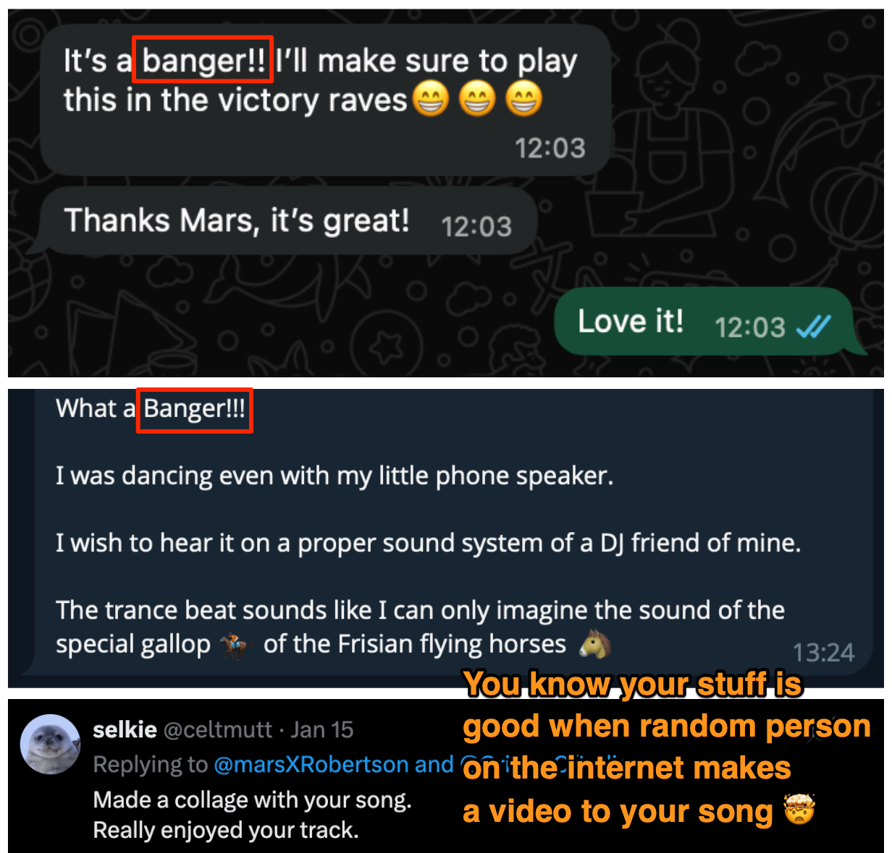

Can you believe that someone made a video for me?

Source: https://x.com/celtmutt/status/2011791656828432623

Google Doc that collects these: https://docs.google.com/document/d/1MAEBrUbVKiY1lu3qQ30cNT98T85iRyUh6D2Jwci0Ynw/edit?usp=sharing

LYRICS

[instrumental intro]
[instrumental intro]
[instrumental intro]

People love freedom

I love freedom too

Because I’m a human 

Normal thing to do 

[bridge]
[instrumental]

People love freedom

It means religious too

Your faith is your own

Not forced on you

[bridge]

[instrumental]

People love freedom

Choosing what to wear

Hijab makes it simple

Must be hot out there

[bridge]

[instrumental]

People love freedom

To browse the internet

Starlink faces jammers

Bad day for the spammers

[bridge]

[instrumental]

People love freedom

Across the board

Do as you will

Not as you’re told

[bridge]

[instrumental]

What’s going on with Iran?

No one knows for sure

Maybe you should run

Maybe you should stay

Stay safe out there

Freedom will find a way

[instrumental outro]
[instrumental outro]
[instrumental outro]